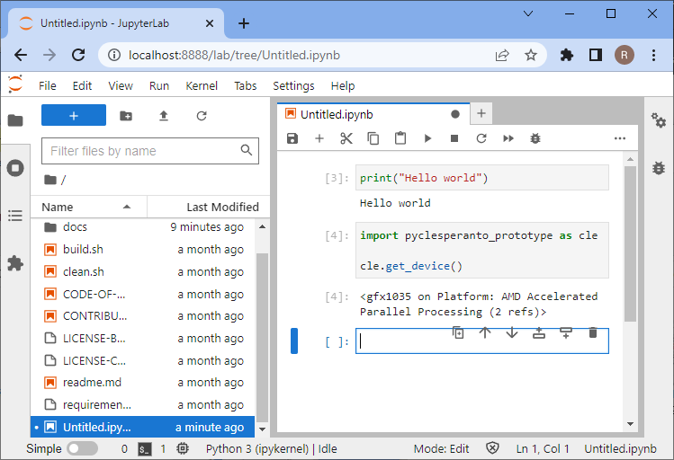

# Configuración de tu computadora

Este capítulo proporciona instrucciones para configurar tu computadora para ejecutar Python y analizar imágenes.

# Configuración de Python y entornos Conda
Cuando trabajamos con Python, utilizaremos muchos complementos y bibliotecas de software que necesitan ser organizados.
Una forma de hacer esto es mediante la gestión de entornos *Conda*.
Un entorno Conda puede verse como un escritorio virtual o una computadora virtual, accesible a través de la terminal.
Si instalas algún software en un entorno Conda, es posible que no sea accesible desde otro entorno.
Si un entorno Conda se rompe, por ejemplo, si se instaló software incompatible, simplemente puedes crear uno nuevo y empezar de nuevo.

Ver también
* [Primeros pasos con Mambaforge y Python](https://biapol.github.io/blog/mara_lampert/getting_started_with_mambaforge_and_python/readme.html)
* [Gestión de entornos Python científicos usando Conda, Mamba y amigos](https://focalplane.biologists.com/2022/12/08/managing-scientific-python-environments-using-conda-mamba-and-friends/)
* [Análisis de datos científicos con Python](https://youtu.be/MOEPe9TGBK0)

## Paso 1: Instalar Mambaforge
Descarga e instala Conda. Recomendamos la distribución Conda [Mambaforge](https://github.com/conda-forge/miniforge#mambaforge).

Para facilitar su uso, se recomienda instalarlo solo para tu uso y agregar Conda a la variable PATH durante la instalación.


## Paso 2: Instalar devbio-napari

Recomendamos instalar [devbio-napari](https://github.com/haesleinhuepf/devbio-napari), una distribución de napari con un conjunto de complementos para el análisis de bioimágenes.

Usa este comando desde la terminal:

```
mamba create --name devbio-napari-env python=3.9 devbio-napari -c conda-forge
```

**Consejo**: Se recomienda crear un entorno para cada proyecto que estés ejecutando.
De esta manera, las bibliotecas de software y herramientas instaladas no pueden dañarse entre sí.

## Paso 3: Probar la instalación

Después puedes ingresar al entorno para trabajar con él.
Siempre que quieras trabajar en el mismo proyecto nuevamente, debes iniciar una línea de comandos e ingresar esto:

```
mamba activate devbio-napari-env
```

Inicia [Jupyter lab](https://jupyter.org/) desde la terminal de esta manera

```
jupyter lab
```

Se abrirá un navegador y te mostrará la siguiente página web. En la sección `Notebook` haz clic en "Python 3 (ipykernel)" para crear un nuevo notebook:


En el nuevo notebook, haz clic en la primera celda de código, ingresa `print("Hola mundo")` y presiona SHIFT+ENTER en tu teclado.
Si todo está instalado correctamente, debería verse así:


Para probar si el controlador de tu tarjeta gráfica está instalado correctamente, ingresa este código:

```
import pyclesperanto_prototype as cle

cle.get_device()
```



## Solución de problemas: Controladores de tarjetas gráficas

En caso de que los mensajes de error contengan "ImportError: DLL load failed while importing cl: The specified procedure could not be found" [ver también](https://github.com/clEsperanto/pyclesperanto_prototype/issues/55) o "clGetPlatformIDs failed: PLATFORM_NOT_FOUND_KHR", por favor instala controladores recientes para tu tarjeta gráfica y/o dispositivo OpenCL.

Selecciona la fuente de controlador correcta dependiendo de tu hardware de esta lista:

* [Controladores AMD](https://www.amd.com/en/support)
* [Controladores NVidia](https://www.nvidia.com/download/index.aspx)
* [Controladores GPU Intel]()(https://www.intel.com/content/www/us/en/download/726609/intel-arc-graphics-windows-dch-driver.html)
* [Controladores OpenCL para CPU Intel](https://www.intel.com/content/www/us/en/developer/articles/tool/opencl-drivers.html#latest_CPU_runtime)
* [Soporte OpenCL de Microsoft Windows](https://www.microsoft.com/en-us/p/opencl-and-opengl-compatibility-pack/9nqpsl29bfff)

A veces, los usuarios de Mac necesitan instalar esto:

    mamba install -c conda-forge ocl_icd_wrapper_apple

A veces, los usuarios de Linux necesitan instalar esto:

    mamba install -c conda-forge ocl-icd-system

## Solución de problemas: Fallo en la carga de DLL

En caso de mensajes de error como este:
```
[...] _get_win_folder_with_pywin32
from win32com.shell import shellcon, shell
ImportError: DLL load failed while importing shell: The specified procedure could not be found.
```

Intenta este comando, dentro del entorno base:

```
conda activate base

pip install --upgrade pywin32==228
```

[Fuente](https://github.com/conda/conda/issues/11503)