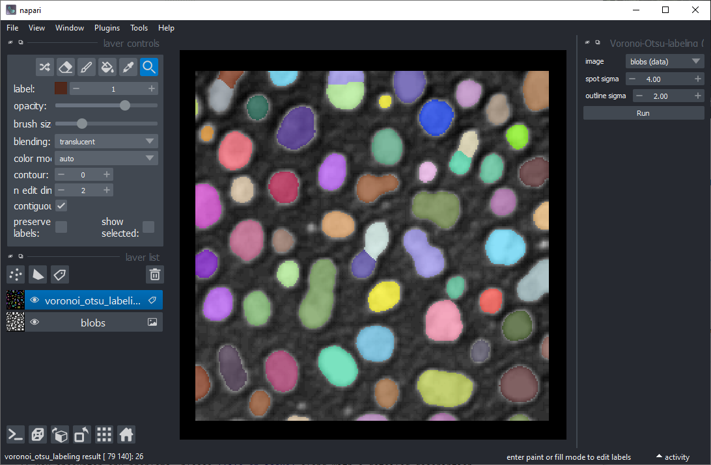
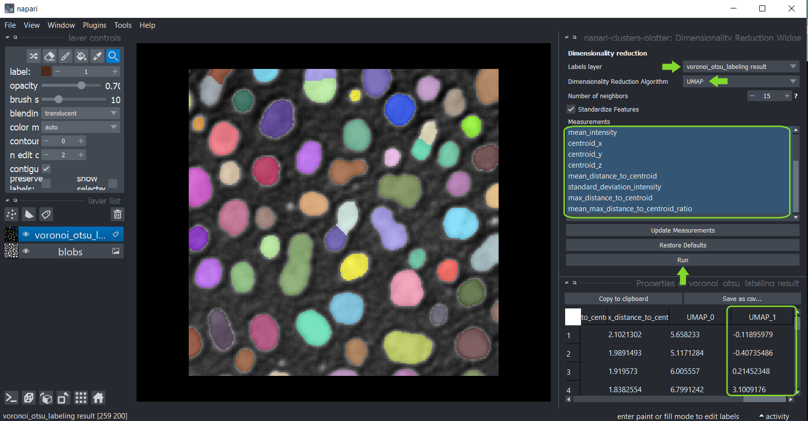

# Reducción de dimensionalidad y agrupamiento interactivos

El [napari-clusters-plotter](https://github.com/BiAPoL/napari-clusters-plotter) ofrece herramientas para realizar varios algoritmos de reducción de dimensionalidad y métodos de agrupamiento de forma interactiva en Napari.

## Primeros pasos

Abre una ventana de terminal y activa tu entorno conda:

```
conda activate devbio-napari-env
```

Después, inicia Napari:

```
napari
```

Carga el conjunto de datos de ejemplo "Blobs" desde el menú `File > Open Sample > clEsperanto > Blobs (from ImageJ)`.
También necesitamos una imagen de etiquetas. Puedes crearla usando el menú `Tools > Segmentation / labeling > Gauss-Otsu Labeling (clesperanto)`.

## Punto de partida
Para agrupar objetos según sus propiedades, el punto de partida es una imagen de intensidad y una imagen de etiquetas
que representa una segmentación de objetos.



## Mediciones
El primer paso es extraer mediciones de la imagen etiquetada y los píxeles correspondientes en la imagen de intensidad.
Puedes usar el menú `Tools > Measurement > Regionprops (scikit-image, nsr)` para eso.
Simplemente selecciona la imagen de intensidad, la imagen de etiquetas correspondiente y las mediciones `intensity`, `size` y `shape` y haz clic en `Run`.
Se abrirá una tabla con las mediciones:


Después, puedes guardar y/o cerrar la tabla de mediciones. También cierra el widget de Medición.

## Gráficos

Una vez realizadas las mediciones, estas se guardaron en las `features` de la capa de etiquetas que fue analizada.
Puedes entonces graficar estas mediciones usando el menú `Tools > Measurement > Plot measurements (ncp)`.

En este widget, puedes seleccionar la capa de etiquetas que fue analizada y las mediciones que deben graficarse
en los ejes X e Y. Si no puedes ver ninguna opción en los cuadros de selección de ejes, pero has realizado mediciones, haz clic
en `Update Axes/Clustering Selection Boxes` para actualizarlos. Haz clic en `Run` para dibujar los puntos de datos en el área del gráfico.


También puedes seleccionar manualmente una región en el gráfico. Usa el ratón para dibujar un contorno alrededor de la región de interés. 
El agrupamiento manual resultante también se visualizará en la imagen original. 
Para optimizar la visualización en la imagen, desactiva la visibilidad de la capa de etiquetas analizada.


Mantén presionada la tecla SHIFT mientras anotas regiones en el gráfico para seleccionar manualmente múltiples grupos.


## Reducción de dimensionalidad: UMAP, t-SNE o PCA

Para obtener más información sobre tus datos, puedes reducir la dimensionalidad de las mediciones, por ejemplo
usando el [algoritmo UMAP](https://umap-learn.readthedocs.io/en/latest/), [t-SNE](https://scikit-learn.org/stable/modules/generated/sklearn.manifold.TSNE.html)
o los algoritmos [PCA](https://scikit-learn.org/stable/modules/generated/sklearn.decomposition.PCA.html).
Para aplicarlos a tus datos usa el menú `Tools > Measurement > Dimensionality reduction (ncp)`.
Selecciona la imagen de etiquetas que fue analizada y en la lista de abajo, selecciona todas las mediciones que deben ser reducidas en dimensionalidad. 
Por defecto, todas las mediciones están seleccionadas en el cuadro. Si no puedes ver ninguna medición, pero las has realizado, haz clic en `Update Measurements` para actualizar el cuadro. 
Puedes leer más sobre los parámetros de ambos algoritmos pasando el cursor sobre los signos de interrogación o haciendo clic en ellos. 
Cuando hayas terminado con la selección, haz clic en `Run` y después de un momento, la tabla de mediciones reaparecerá con dos columnas adicionales que representan las dimensiones reducidas del conjunto de datos. 
Estas columnas se guardan automáticamente en las `features` de la capa de etiquetas.



Después, puedes nuevamente guardar y/o cerrar la tabla. También cierra el widget de Reducción de Dimensionalidad.

## Agrupamiento

Si los puntos de datos están claramente separados, el agrupamiento automático puede ser una opción, utilizando estos algoritmos implementados:
* [Agrupamiento k-means (KMEANS)](https://towardsdatascience.com/k-means-clustering-algorithm-applications-evaluation-methods-and-drawbacks-aa03e644b48a)
* [Agrupamiento Espacial Basado en Densidad de Aplicaciones con Ruido Jerárquico (HDBSCAN)](https://hdbscan.readthedocs.io/en/latest/how_hdbscan_works.html)
* [Modelo de Mezcla Gaussiana (GMM)](https://scikit-learn.org/stable/modules/mixture.html)
* [Desplazamiento Medio (MS)](https://scikit-learn.org/stable/auto_examples/cluster/plot_mean_shift.html#sphx-glr-auto-examples-cluster-plot-mean-shift-py)
* [Agrupamiento Aglomerativo (AC)](https://scikit-learn.org/stable/modules/generated/sklearn.cluster.AgglomerativeClustering.html)

Por lo tanto, haz clic en el menú `Tools > Measurement > Clustering (ncp)` y selecciona la capa de etiquetas analizada.
Esta vez selecciona las mediciones para el agrupamiento, por ejemplo, selecciona _solo_ las mediciones `UMAP`.
Selecciona el método de agrupamiento `KMeans` y haz clic en `Run`.
La tabla de mediciones reaparecerá con una columna adicional `KMeans_CLUSTERING_ID` que contiene el ID de cluster de cada punto de datos.


Después, puedes nuevamente guardar y/o cerrar la tabla. También cierra el widget de agrupamiento.

## Graficando resultados de agrupamiento
Vuelve al widget Plotter usando el menú `Tools > Measurement > Plot measurements (ncp)`.
Selecciona `UMAP_0` y `UMAP_1` como ejes X e Y y el `KMeans_CLUSTERING_ID` como `Clustering`, y haz clic en `Run`.

