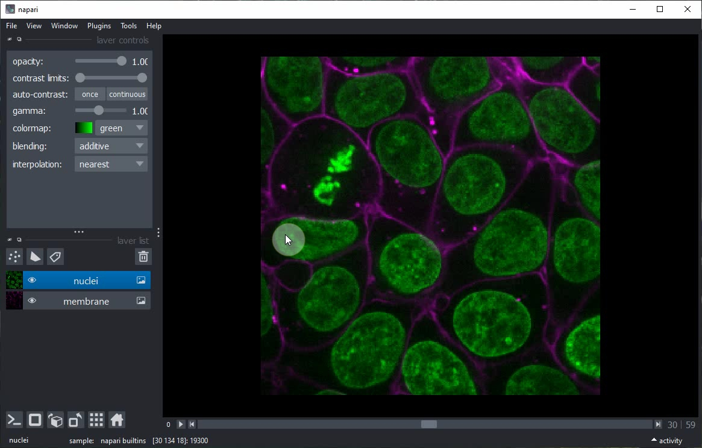
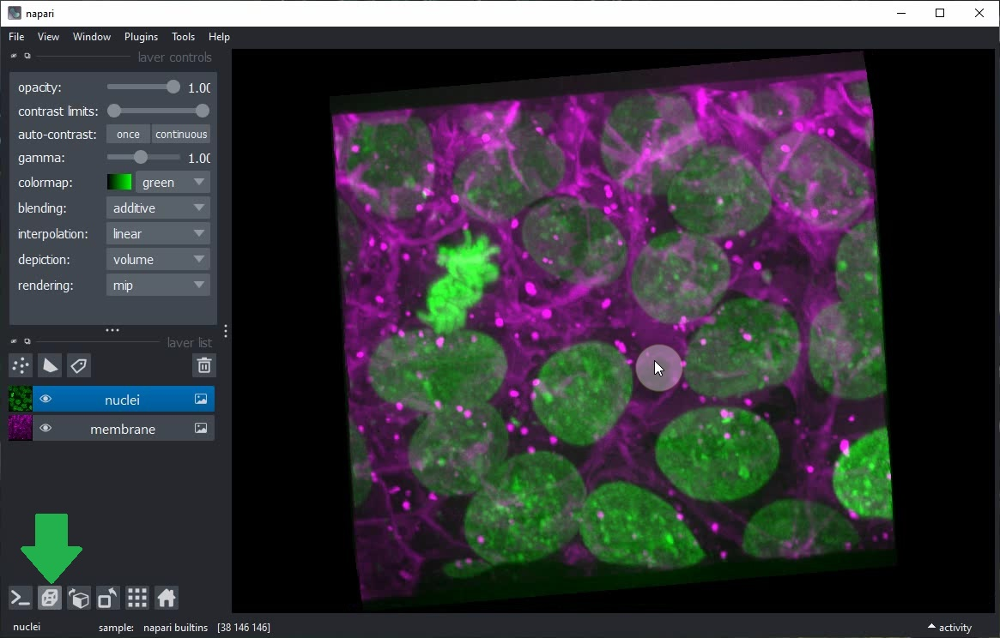
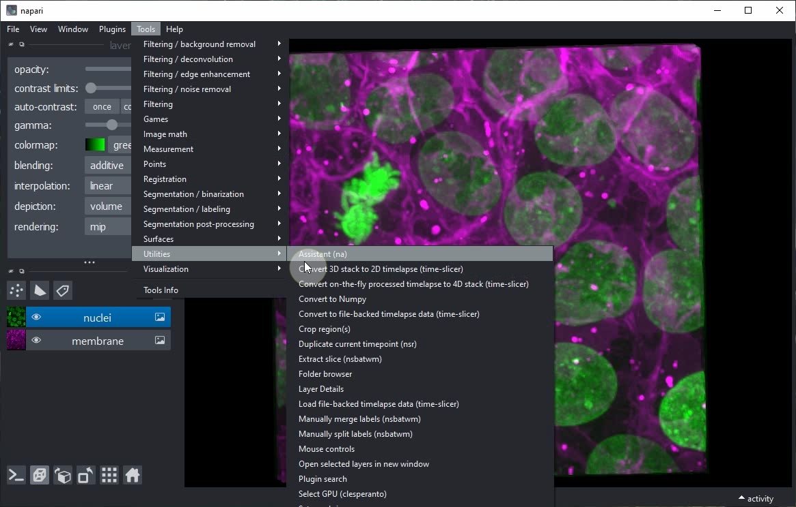
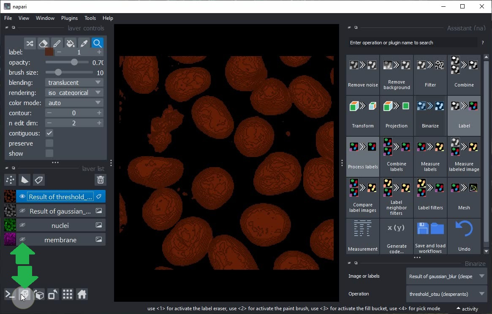
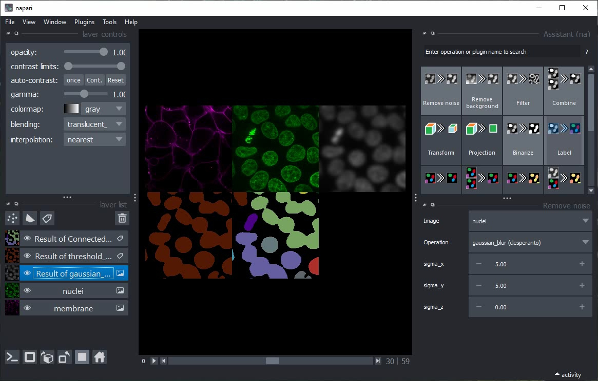
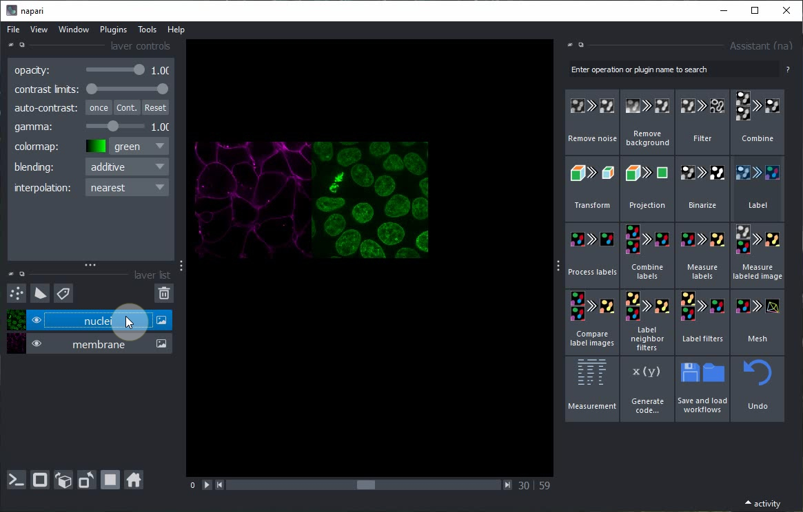

# El Asistente de Napari

El Asistente de Napari es un complemento para napari que te permite configurar un flujo de trabajo de procesamiento de imágenes.

Este tutorial también está disponible en video [napari-assistant.mp4](images/napari-assistant.mp4).

Inicia napari desde la línea de comandos de esta manera:

```bash
conda activate my_first_env

napari
```


Se abrirá la ventana de napari. Haz clic en el menú `Archivo > Abrir Muestras Células(3D+2Ch)` para abrir una imagen de ejemplo.




Puedes explorar este conjunto de datos haciendo clic en el botón de vista `2D/3D`.



Inicia el Asistente de Napari desde el menú `Herramientas > Utilidades > Asistente (na)`.



Dentro del panel `Asistente`, haz clic en el botón `Eliminar ruido`.


Haz clic en los botones `Ojo` en la lista de capas para ocultar la imagen original y mostrar solo el resultado del paso `Eliminar ruido`.


Haz clic en el botón `Binarizar` en el panel del Asistente para agregar un nuevo paso al flujo de trabajo que genera una imagen binaria a partir de la capa actual.


Alterna entre las vistas 2D/3D y la visibilidad de las capas para explorar el resultado del paso `Binarizar`.



Después de volver a la vista 2D, haz clic en el botón `Etiquetar` en el Asistente y elige la operación `Etiquetado de componentes conectados (clEsperanto)`.


Selecciona la capa `Resultado de gaussian_blur` en la lista de capas y modifica sus parámetros `sigma`. Notarás que los pasos subsiguientes (Umbral de Otsu y Etiquetado de Componentes Conectados) también se actualizan.


Cambia a la vista de cuadrícula, muestra todas las capas usando sus botones `Ojo` y continúa modificando los parámetros.




Cierra todas las capas excepto `núcleos` y `membrana`.



Desactiva la vista de cuadrícula y haz clic nuevamente en el botón `Etiquetar` en el Asistente.


Esta vez, no cambies la operación sino el parámetro `spot_sigma` en su lugar.


Cambia nuevamente a la vista 3D e inspecciona el resultado de este único paso.

