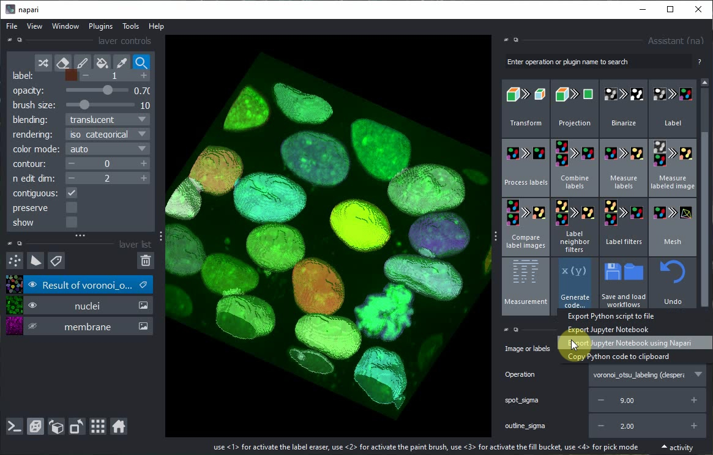

# Generación de Cuadernos Jupyter desde el Asistente de Napari

Después de configurar un flujo de trabajo usando el Asistente de Napari, podemos exportar código Python, por ejemplo, como Cuaderno Jupyter.

Este tutorial también está disponible en video [export_notebooks.mp4](images/export_notebooks.mp4)

En el panel del Asistente, haz clic en el botón `Generar Código...` y en el menú `Exportar Cuaderno Jupyter usando Napari`.



Jupyter lab se abrirá y te pedirá que selecciones un Kernel. Mantén la opción predeterminada y haz clic en `Seleccionar`.


Al ejecutar el cuaderno, pueden aparecer errores, por ejemplo, al cargar los datos.


Desplázate hacia abajo hasta el final del mensaje de error para leer qué no funcionó.


Desplázate hacia arriba de nuevo hasta la celda del cuaderno que no funcionó y modifica el código para que use la función `imread` para cargar la imagen desde el disco.


En caso de que aún no tengas la imagen `nuclei` guardada en el disco, usa el menú `Archivo > Guardar Capa(s) actual(es)` para guardar la capa `nuclei` como archivo `.tif`.


Después, vuelve a ejecutar el cuaderno e inspecciona el resultado. El visor de Napari que se abrió en segundo plano también se mostrará dentro del cuaderno.


Si también quieres ver los datos de la imagen en bruto junto con el resultado de la segmentación, añade estas líneas a tu código:

```python
viewer.add_image(image0_n)
napari.utils.nbscreenshot(viewer)
```


Vuelve a ejecutar el cuaderno, o modifica manualmente el orden de las capas en el visor de Napari. Al final debería verse así.


¡Voilà! Ahora has generado un Cuaderno Jupyter a partir de un flujo de trabajo del Asistente de Napari. Este cuaderno documenta tu trabajo de manera reproducible y puede ser compartido con otros.